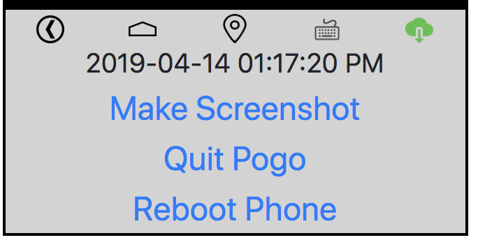

# Using phonecontrol

## Detect kind of connection

### WS only

Phone is only connected over websocket

### WS and ADB

Phone is connected over websocket and ADB

### only ADB

Phone is only connected over ADB

**Something is wrong! Check that phone. Mad would not work with it**

## Control panel

Use this panel to control the phone

**Icons: (from left to right)**
* Android: back
* Android: homescreen
* Set GPS Coords (WS mode only!)
* Send texts to phones
* Save screenshot

## Phone screen

You could interact with the phone by clicking (click on screen) or swiping (click and hold while moving the mouse)

## Statement of the author

Use this tool for quit interaction with the phone. It´s not a full remote support tool. But better then using vnc or other non-free tools. Have fun with it!