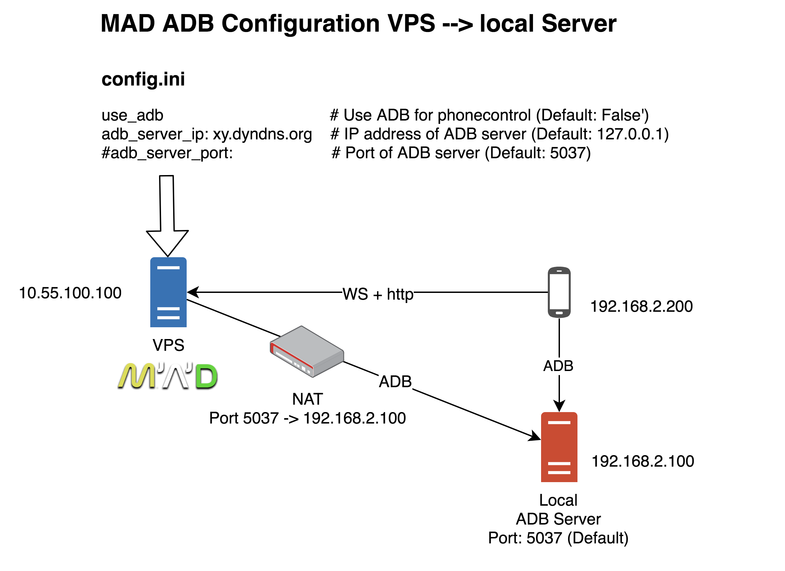
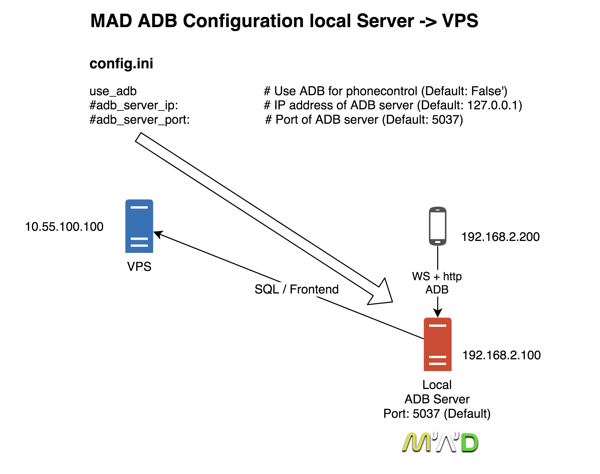
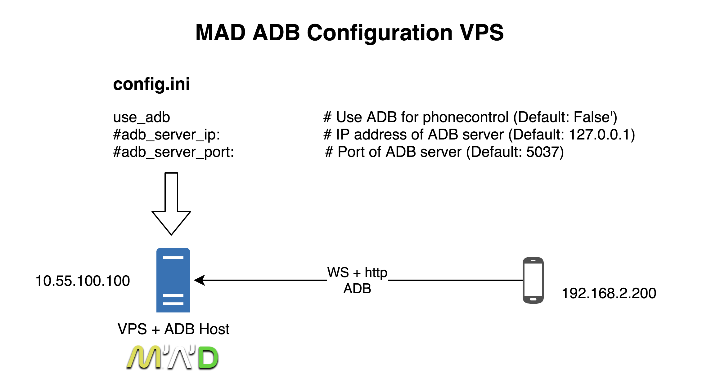

# ADB for MAD (MADmin Phonecontrol)

## Why?

ADB connect your phones to MAD and let you control them even if they lost the websocket connection.
Follow features are available:
* Making Screenshots
* Interact with phone (clicking and swiping)
* send texts
* sending commands (pogo restart and others)

**Not working: set GPS coords**

## Pro / Cons

### Pro
* Quick remote support for phones
* Checking the phone status better then status page on MADmin

### Cons
* Technically slower due to Python, mitigated by no daemon.
* Only one command per device at a time.

## Setting up the ADB feature

You need a local installed Server (like a raspi) or you could use your existing instance from MAD. Install the adb package and activate it.

Installation for raspi:

`sudo apt-get update`

`sudo apt-get install -y android-tools-adb android-tools-fastboot`

> ToDo: installation and configuration howto

## Installation: VPS with MAD - local Server

You need a port forwarding at your local router to get a ADB connection from the MAD VPS.
Default Port: 5037

**config.ini**

`use_adb                                     # Use ADB for phonecontrol (Default: False)`

`adb_server_ip: xy.dyndns.org    # IP address of ADB server (Default: 127.0.0.1)`

`#adb_server_port:                      # Port of ADB server (Default: 5037)`

## Installation: local Server with MAD

Your local server do all the stuff - VPS only for DB and/or Frontend

**config.ini**

`use_adb                                     # Use ADB for phonecontrol (Default: False)`

`#adb_server_ip:                 # IP address of ADB server (Default: 127.0.0.1)`

`#adb_server_port:                      # Port of ADB server (Default: 5037)`

## Installation: VPS with MAD

Connecting the phones to your VPS. No local server os required.

**config.ini**

`use_adb                                     # Use ADB for phonecontrol (Default: False)`

`#adb_server_ip:                  # IP address of ADB server (Default: 127.0.0.1)`

`#adb_server_port:                      # Port of ADB server (Default: 5037)`
