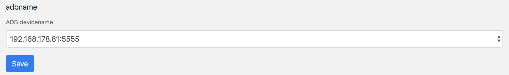

# Configuration

## Phone configuration

- Enable remote ADB connection (for LAN)

> ToDo: how to activate it permanently?

## Server configuration

connect phones with `adb connect *ip-of-phone*`

> ToDo: reconnect lost phones automatically?

## MAD configuration

_Device-Configuration_ --> choose ADB device and save

## Error handling

If the device is not in the list, check local adb configuration or config.ini parameter.
The list is generated of all connected phones.